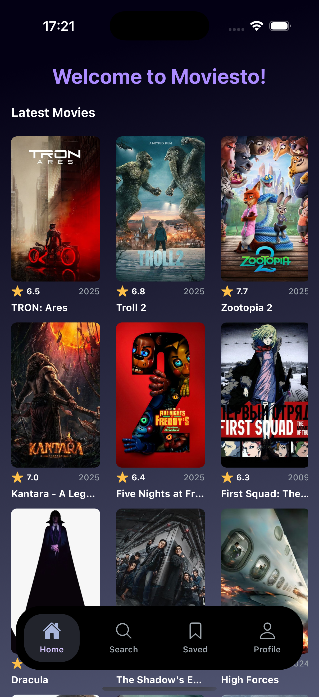
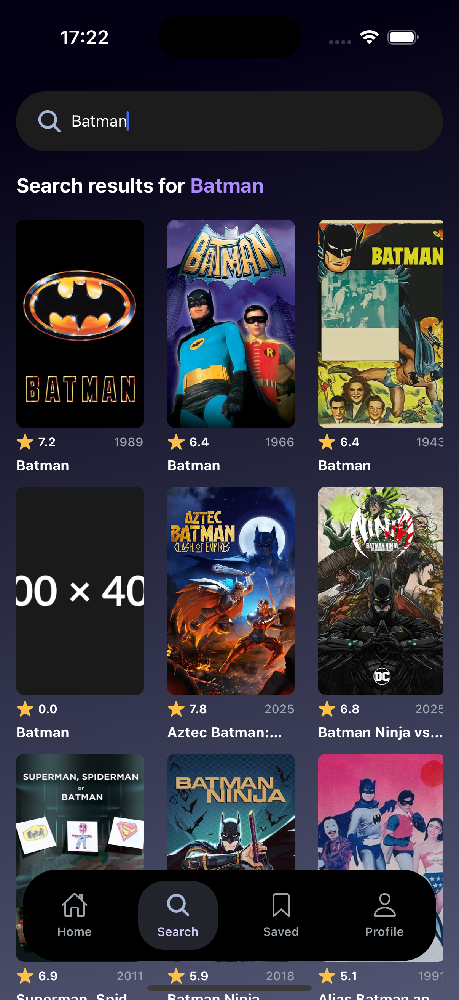

# Moviesto

Moviesto is a mobile movie discovery app built with Expo Router, NativeWind, and the TMDB API. It surfaces popular titles and lets you search instantly, with light Appwrite metrics tracking to understand what users look for.

## Preview

<table>
  <tr>
    <td align="center" width="33%">
      
      <div>Home</div>
    </td>
    <td align="center" width="33%">
      
      <div>Search</div>
    </td>
    <td align="center" width="33%">
      <div><em>More previews coming soon</em></div>
    </td>
  </tr>
</table>

## Features

- Browse popular and recent movies with posters, ratings, and release years.
- Debounced search powered by TMDB, rendered in a performant grid.
- Gradient theming, safe-area-aware layout, and NativeWind styling.
- Bottom tab navigation for quick access to core screens.
- Appwrite metrics capture for searched terms (first match per query).

## Tech Stack

- Expo Router + React Native (TypeScript)
- NativeWind (Tailwind) for styling
- TMDB API for movie data
- Appwrite Tables for search metrics

## Getting Started

1. Install dependencies:

   ```bash
   npm install
   ```

2. Create a `.env` file in the project root with the following values:

   ```bash
   EXPO_PUBLIC_MOVIE_API_KEY=tmdb_read_access_token
   EXPO_PUBLIC_APPWRITE_ENDPOINT=https://cloud.appwrite.io/v1
   EXPO_PUBLIC_APPWRITE_PROJECT_ID=your_project_id
   EXPO_PUBLIC_APPWRITE_DATABASE_ID=your_database_id
   ```

   - TMDB requires the “Read access token (v4 auth)” from your TMDB account.
   - Appwrite expects a table named `metrics` with fields for `searchTerm`, `movie_id`, `title`, `poster_url`, and `count`.

3. Start the dev server:

   ```bash
   npm start
   ```

4. Open the project in Expo Go, an iOS simulator, or an Android emulator.

## Scripts

- `npm start` — launch Expo dev server
- `npm run android` / `npm run ios` / `npm run web` — open on a specific platform
- `npm run lint` — run Expo lint rules
- `npm run reset-project` — reset the starter template
